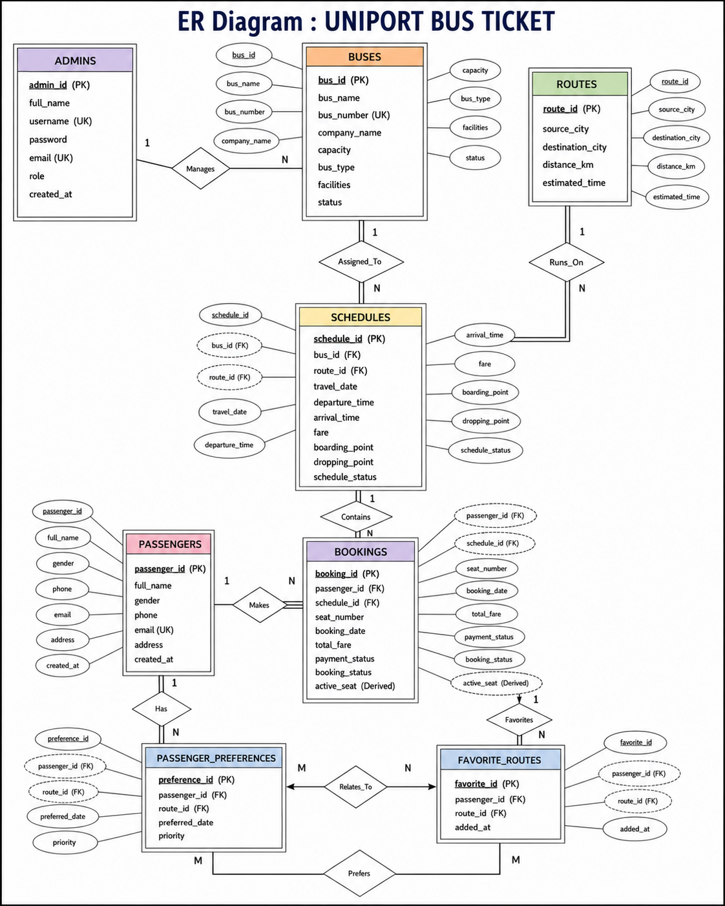

Markdown
# Uniport – Bus Ticket Booking System

A database-driven web application developed to simplify and modernize the process of bus ticket reservation and management. The system provides an efficient digital platform for searching buses, booking tickets, managing schedules, routes, passengers, and maintaining booking history.

---

# Table of Contents

1. Project Overview  
2. Objectives  
3. Main Features  
4. Technology Stack  
5. Project Structure  
6. Setup Instructions  
7. Database Design  
8. Database Tables  
9. Database Relationships  
10. System Workflow  
11. Project Screenshots  
12. ER Diagram  
13. Team Contributions  
14. Future Improvements  
15. Conclusion  

---

# Project Overview

Traditional bus ticket booking systems are often handled manually. This can create several problems such as:

- Human errors in ticket booking
- Difficult record maintenance
- Time-consuming processes
- Data inconsistency
- Inefficient passenger management

Uniport provides a complete digital solution that simplifies these problems using a relational database system. The project uses structured database design with primary keys, foreign keys, constraints, and normalization to ensure data integrity and consistency.

---

# Objectives

The main objectives of this project are:

- Design and develop a structured database for managing bus ticket bookings
- Store passenger information efficiently
- Manage bus schedules and routes
- Automate ticket booking and cancellation processes
- Ensure data integrity using database constraints
- Maintain booking history records
- Reduce manual work and errors
- Demonstrate practical implementation of relational databases

---

# Main Features

## User Management

- User Registration
- User Login
- User Dashboard
- Session Management
- Logout Functionality

## Bus Search System

- Search buses by source city
- Search buses by destination city
- View travel information
- Search by travel date

## Ticket Booking System

- Book bus tickets
- Seat selection
- Seat availability checking
- Booking confirmation

## Passenger Information Management

- Passenger details storage
- Contact information management
- Booking history tracking

## Bus Management

- Bus information management
- Capacity management
- Bus type management
- Facilities management

## Route Management

- Source city
- Destination city
- Distance information
- Estimated travel time

## Schedule Management

- Departure time
- Arrival time
- Travel date
- Boarding point
- Dropping point

## Booking Records

- Booking history
- Payment status
- Booking status
- Ticket tracking

---

# Technology Stack

| Layer | Technology |
|---------|------------|
| Frontend | HTML5 |
| Styling | CSS3 |
| Backend | PHP |
| Additional Processing | Python |
| Database | MySQL |
| Database Query Language | SQL |

---

## Project Structure

```text
Uniport/
│
├── config/
│   ├── connect.php          → Database connection
│   └── functions.php        → Helper functions
│
├── includes/
│   ├── navbar.php           → Navigation bar
│   └── footer.php           → Footer section
│
├── assets/
│   ├── css/
│   │   └── style.css        → Main stylesheet
│   │
│   ├── js/
│   │   └── script.js        → JavaScript functions
│   │
│   └── images/
│       ├── logo.png
│       ├── bus.png
│       └── banner.jpg
│
├── pages/
│   ├── auth/
│   │   ├── login.php
│   │   ├── register.php
│   │   └── logout.php
│   │
│   ├── booking/
│   │   ├── booking.php
│   │   ├── history.php
│   │   └── cancel.php
│   │
│   ├── bus/
│   │   ├── search.php
│   │   ├── routes.php
│   │   └── schedule.php
│   │
│   └── admin/
│       ├── dashboard.php
│       ├── manage_bus.php
│       └── manage_booking.php
│
├── screenshots/
│   ├── homepage.png
│   ├── dashboard.png
│   └── erdiagram.png
│
├── database.sql             → Database file
├── index.php                → Homepage
└── README.md                → Project details
```

# Setup Instructions

## Step 1

Copy project folder:

C:\xampp\htdocs\Uniport\
```

## Step 2

Open phpMyAdmin:

```text
http://localhost/phpmyadmin
```

Create database:

```sql
uniport_db
```

Import:

uniport_db.sql
```

## Step 3

Open browser:

```text
http://localhost/Uniport/
```

---

# Database Tables

### Admins Table

- admin_id
- full_name
- username
- password
- email
- role

### Passengers Table

- passenger_id
- full_name
- gender
- phone
- email
- address

### Buses Table

- bus_id
- bus_name
- bus_number
- company_name
- capacity
- bus_type
- facilities
- status

### Routes Table

- route_id
- source_city
- destination_city
- distance_km
- estimated_time

### Schedules Table

- schedule_id
- bus_id
- route_id
- travel_date
- departure_time
- arrival_time
- fare

### Bookings Table

- booking_id
- passenger_id
- schedule_id
- seat_number
- booking_date
- total_fare
- payment_status
- booking_status

---

# Database Relationships

- One Passenger can make multiple bookings
- One Bus can have multiple schedules
- One Route can contain multiple schedules
- One Schedule can contain multiple bookings
- One Passenger can have multiple booking records

---

# System Workflow

Registration/Login
        ↓
Search Bus
        ↓
Select Route
        ↓
Seat Availability Check
        ↓
Book Ticket
        ↓
Store Data in Database
        ↓
Update Booking History

---

# Project Screenshots

## Home Page


## Login Page


## Register Page


## Dashboard


## Search Bus


## Search Result


## Booking History


---

# ER Diagram


---

# Team Contributions

| Member | Contribution |
|----------|-------------|
| Md. Farhan Masrib | Backend Logic, SQL Queries, Documentation |
| Ifrat Jahan | ER Diagram, Seat Availability |
| Shoreful Hassan Nipu | Cancellation System, UI Design |
| Mahib Ullah | Bus Management, Reports |

---

# Future Improvements

- Online Payment Integration
- Email Verification
- Real-Time Bus Tracking
- SMS Notification System
- Advanced Admin Dashboard
- Mobile Responsive Improvements

---

# Conclusion

Uniport demonstrates how a relational database system can be applied in a real-world transportation environment. The project improves efficiency, reduces manual work, maintains data consistency, and provides an organized solution for bus ticket management.

## ER Diagram

